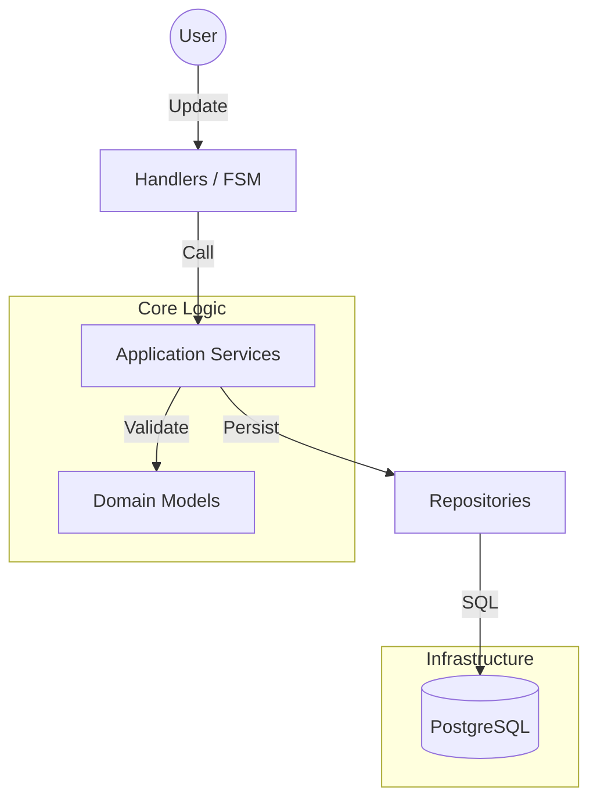
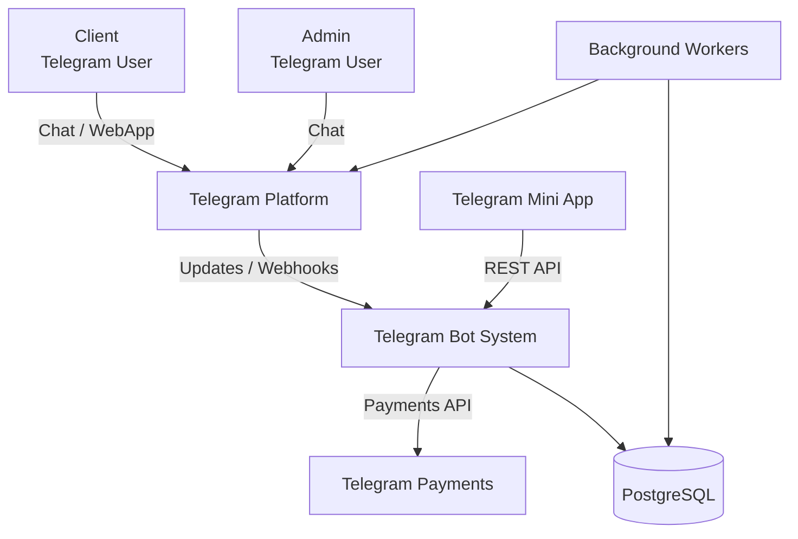
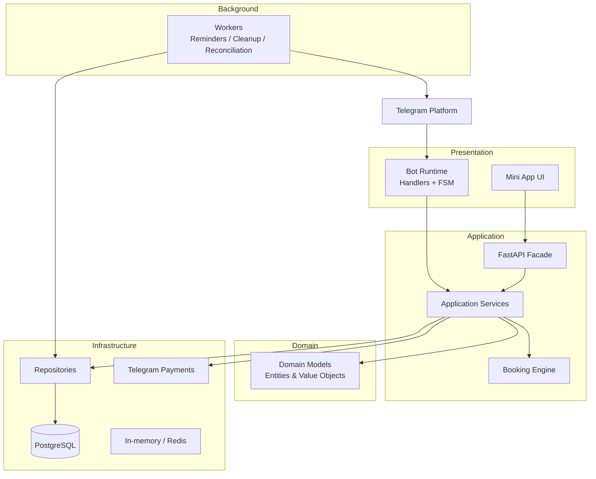

# Architecture Deep Dive

## Clean Architecture Overview
- **Interface layer:** Telegram handlers and keyboards (presentation only).
- **Application layer:** Services orchestrate use cases, enforce policies, and drive FSM transitions.
- **Domain layer:** Entities and value objects encode invariants (no double booking, correct durations, timezone safety).
- **Infrastructure layer:** PostgreSQL, repositories, logging, payments, notifications.

## Layer Responsibilities
- **Handlers:** Parse input, call services, render responses; stateless aside from navigation tokens.
- **Services:** Policies, validation, FSM state transitions, event dispatch to workers.
- **Domain:** `Booking`, `Service`, `Master`, `Customer`, `Payment`, `Policy`; value objects: `Money`, `Duration`, `TimeWindow`.
- **Repositories:** PostgreSQL persistence, advisory locks, pagination/filtering.
- **Core:** DB sessions, structured logging, configuration, notifications.
- **Workers:** Reminders, stale-hold cleanup, notifications, reconciliation.

## Navigation and FSM
- Finite-state machines per flow with explicit transitions and guards.
- Navigation stack retains view history so Back returns to prior context (filters, pagination).

## System Architecture

## Booking Engine
- Gap search across working hours, breaks, existing bookings to find valid starts.
- Composite services aggregate durations and require masters with matching skills.
- Per-master timing (speed) respected for availability and pricing snapshots.
- Advisory locks (`pg_advisory_xact_lock`) wrap booking creation to prevent double bookings.
- Holds during payment; timeout releases automatically.

## Timezones
- Store all timestamps in UTC; render in business or user timezone.
- Reminders scheduled once in UTC to avoid DST drift.

## Payments and Policies
- Telegram Payments; configurable prepayment or full payment.
- Cancellation/reschedule lock windows, optional fees, lead-time and future-window limits.

## Analytics
- LTV, retention, no-show rate, revenue (realized vs expected), CSV export.

## Data Model (high level)
- **Customer:** profile, language, timezone.
- **Service:** name, duration, price, currency, category, visibility.
- **Master:** skills, working hours, breaks, speed modifiers.
- **Booking:** status, start/end, master, services, pricing snapshot, hold/confirm states.
- **Payment:** status, provider payload, audit trail.
- **Policy:** cancellation window, reschedule window, payment rules.
- **Audit events:** who did what and when.

## Observability
- Structured logs with `event`, `user_id`, `role`, `booking_id`, `state`, `flow`, `correlation_id`.
- Ready for centralization (ELK/Loki/etc.).

## Security & Integrity
- Principle of least privilege on DB access.
- No business logic in handlers; permissions checked in services.
- Advisory locks + constraints + status guards to keep bookings consistent.

For operational details see [DEPLOY](DEPLOY.md). For workflow and extension guidance see [DEVELOPER_MANUAL](DEVELOPER_MANUAL.md).

### Client WebApp Layer

Telegram Mini App acts as an alternative presentation layer:
- Uses REST API (FastAPI facade)
- Shares domain & services with the bot
- Provides modern UI for client operations

This allows the same business logic to serve:
- Telegram chat interface
- WebApp UI

## C4 — System Context

The system is a Telegram-based booking platform that allows clients to book services, admins to manage schedules, and the business to enforce booking, payment, and policy rules.

Key points:

- Telegram is the primary entry point (chat + Mini App).
- Payments are handled via Telegram Payments.
- PostgreSQL is the system of record.
- Background workers handle async and time-based processes.

## C4 — Container View

The system is composed of multiple runtime containers with clear responsibilities.

## Container Responsibilities

**Presentation Layer**

**Telegram Bot (Handlers / FSM)**
- Accepts incoming updates from Telegram.
- Parses user input and manages FSM state.
- Maintains navigation stack for Back actions.
- Delegates all business decisions to application services.

**Telegram Mini App**
- Client-facing UI for booking and managing visits.
- Communicates with backend via REST API.
- Shares the same business logic as the bot.

**Application Layer**

**Application Services**
- Orchestrate use cases (create booking, confirm payment, reschedule).
- Enforce access rules and business policies.
- Manage transactions and booking holds.
- Emit events for background processing.

**Booking Engine**
- Calculates availability using working hours, breaks, existing bookings, composite services, and per-master speed modifiers.
- Produces pricing snapshots at confirmation time.

**FastAPI Facade**
- Thin HTTP layer for WebApp and integrations.
- Converts HTTP requests into application service calls.

**Domain Layer**

**Domain Models**
- Entities: Booking, Service, Master, Customer, Payment, Policy
- Value Objects: Money, Duration, TimeWindow
- Encodes invariants: no double booking, correct duration and pricing, timezone-safe calculations.
- The domain layer contains no framework, DB, or Telegram dependencies.

**Infrastructure Layer**

**Repositories**
- PostgreSQL persistence.
- Pagination, filtering, reporting.
- Concurrency protection using pg_advisory_xact_lock.

**PostgreSQL**
- Primary source of truth.
- Enforces integrity via constraints and indexes.

**Cache / In-memory Storage**
- Short-lived FSM state and settings cache.
- Optional Redis for scaling.

**Payments**
- Telegram Payments integration.
- External provider payloads stored with audit trail.

**Background Processing**

**Workers**
- Reminder delivery.
- Cleanup of expired booking holds.
- Payment reconciliation.
- Analytics and reporting exports.
- Workers are idempotent and safe to run in multiple replicas.

**Architectural Characteristics**

- Stateless handlers → easy horizontal scaling.
- Single domain model shared across bot and WebApp.
- Strong consistency via DB locks and transactions.
- UTC-based scheduling to avoid DST issues.
- Clear separation of concerns across layers.

**Why This Architecture**

- Supports multiple interfaces (Chat + WebApp) without duplicating logic.
- Prevents double bookings under concurrent load.
- Allows independent scaling of handlers and workers.
- Keeps business rules isolated and testable.
- Ready for long-term evolution and new integrations.

