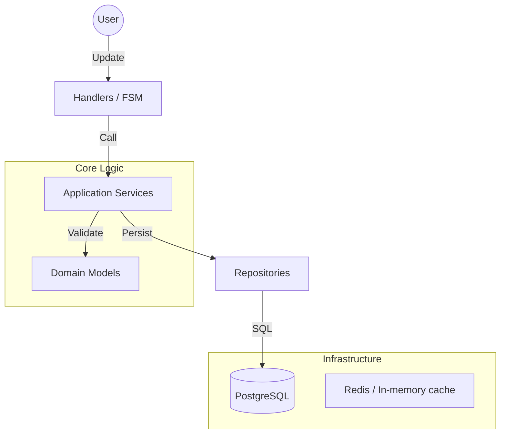

# Architecture Deep Dive

## Clean Architecture Overview
- **Interface layer:** Telegram handlers and keyboards (presentation only).
- **Application layer:** Services orchestrate use cases, enforce policies, and drive FSM transitions.
- **Domain layer:** Entities and value objects encode invariants (no double booking, correct durations, timezone safety).
- **Infrastructure layer:** PostgreSQL, repositories, logging, payments, notifications.

## Layer Responsibilities
- **Handlers:** Parse input, call services, render responses; stateless aside from navigation tokens.
- **Services:** Policies, validation, FSM state transitions, event dispatch to workers.
- **Domain:** `Booking`, `Service`, `Master`, `Customer`, `Payment`, `Policy`; value objects: `Money`, `Duration`, `TimeWindow`.
- **Repositories:** PostgreSQL persistence, advisory locks, pagination/filtering.
- **Core:** DB sessions, structured logging, configuration, notifications.
- **Workers:** Reminders, stale-hold cleanup, notifications, reconciliation.

## Navigation and FSM
- Finite-state machines per flow with explicit transitions and guards.
- Navigation stack retains view history so Back returns to prior context (filters, pagination).

## System Architecture

## Booking Engine
- Gap search across working hours, breaks, existing bookings to find valid starts.
- Composite services aggregate durations and require masters with matching skills.
- Per-master timing (speed) respected for availability and pricing snapshots.
- Advisory locks (`pg_advisory_xact_lock`) wrap booking creation to prevent double bookings.
- Holds during payment; timeout releases automatically.

## Timezones
- Store all timestamps in UTC; render in business or user timezone.
- Reminders scheduled once in UTC to avoid DST drift.

## Payments and Policies
- Telegram Payments; configurable prepayment or full payment.
- Cancellation/reschedule lock windows, optional fees, lead-time and future-window limits.

## Analytics
- LTV, retention, no-show rate, revenue (realized vs expected), CSV export.

## Data Model (high level)
- **Customer:** profile, language, timezone.
- **Service:** name, duration, price, currency, category, visibility.
- **Master:** skills, working hours, breaks, speed modifiers.
- **Booking:** status, start/end, master, services, pricing snapshot, hold/confirm states.
- **Payment:** status, provider payload, audit trail.
- **Policy:** cancellation window, reschedule window, payment rules.
- **Audit events:** who did what and when.

## Observability
- Structured logs with `event`, `user_id`, `role`, `booking_id`, `state`, `flow`, `correlation_id`.
- Ready for centralization (ELK/Loki/etc.).

## Security & Integrity
- Principle of least privilege on DB access.
- No business logic in handlers; permissions checked in services.
- Advisory locks + constraints + status guards to keep bookings consistent.

For operational details see [DEPLOY](DEPLOY.md). For workflow and extension guidance see [DEVELOPER_MANUAL](DEVELOPER_MANUAL.md).

### Client WebApp Layer

Telegram Mini App acts as an alternative presentation layer:
- Uses REST API (FastAPI facade)
- Shares domain & services with the bot
- Provides modern UI for client operations

This allows the same business logic to serve:
- Telegram chat interface
- WebApp UI

